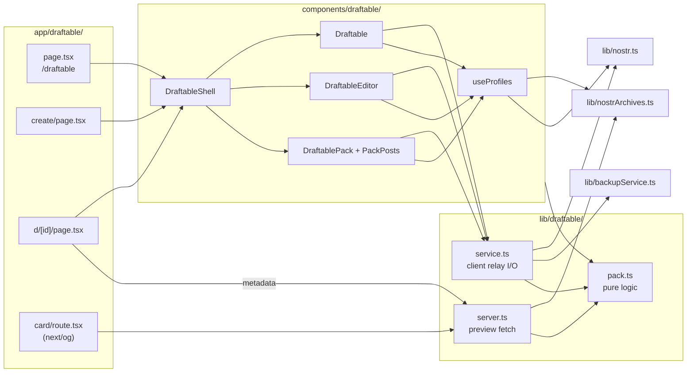

# Draftable handoff

2026-10-09 · The Daniel

Draftable, the following.space follow-pack app rebuilt inside Mutable, shipped in dmnyc/mutable#51; search, `naddr` links, custom pack IDs, follower counts, and the new share card followed in `feat/draftable-improvements`. Publishing a pack and its link preview have been tried for real; the checklist below covers the rest.

## Status and open items

The code is done and passes every local check; what's left is the click-through below.

| Item | State |
| --- | --- |
| Branches | `feat/draftable` (merged in dmnyc/mutable#51), then `feat/draftable-improvements` |
| Pull requests | dmnyc/mutable#51 merged; the improvements have their own PR |
| Old branch | `claude/clever-gates-x9s7bi` is gone from GitHub |
| Typecheck | `npx tsc --noEmit` passes |
| Build | `npm run build` passes; new routes `/draftable`, `/draftable/[ref]` (naddr redirects), `/draftable/create`, `/draftable/d/[id]`, `/draftable/card` |
| Unit tests | 237 pass (56 new, in `tests/draftable-pack.test.ts`, `tests/draftable-service.test.ts`, `tests/draftable-share.test.ts`, and `tests/draftable-find.test.ts`) |
| Lint | `npm run lint` fails repo-wide: Next 16 removed `next lint`. Not caused by this branch |
| Version | 1.10.0, bumped in its own commit |

- [x] Delete `claude/clever-gates-x9s7bi` on GitHub
- [x] Open a PR from `feat/draftable` into `main`. The description should note that following.space hasn't been updated in over a year: the last commit on any branch of [callebtc/nostr-follow-packs](https://github.com/callebtc/nostr-follow-packs) is 2025-07-29, and outside PRs ([#13](https://github.com/callebtc/nostr-follow-packs/pull/13), [#24](https://github.com/callebtc/nostr-follow-packs/pull/24)) sit unmerged
- [ ] Click through a Vercel preview against live relays: browse, "drafted into", Follow All, create, edit, delete, share, and post a share note
- [ ] Paste a `/draftable/d/...` link into a Nostr client or card validator to check the link preview
- [x] Bump the version in its own commit, as the repo usually does
- [ ] Decide whether Draftable stays under Other Stuff or moves to the primary nav

## Feature map

Every following.space feature has a Draftable equivalent except nsec login, which Mutable doesn't offer.

| following.space | In Draftable | Where |
| --- | --- | --- |
| Browse packs: all, from follows, packs I'm in, my packs, "Discover more" | Same four views ("Packs I've been drafted into", "Packs I made"); last view remembered per device | `/draftable`, `components/draftable/Draftable.tsx` |
| (not in upstream) | Look up which packs any npub is in, no login | `/draftable?npub=...`, home-page Draftable button |
| Search by name or creator npub (unmerged upstream PR #13) | "Find a pack" searches the names and descriptions of every pack on Draftable's relays (fetched once, cached 5 minutes); an npub lists that author's packs; a pasted link or `naddr` opens the pack. The term stays in `?q=` | `matchPacks` in `pack.ts`, `fetchAllPacks` in `service.ts`, `Draftable.tsx` |
| `naddr` routes (unmerged upstream PR #24) | `/draftable/naddr1…` and `/draftable/d/naddr1…` redirect to the pack page, carrying up to three `wss://` relay hints as `?r=`. Only the browser follows hints; the server preview doesn't, to avoid SSRF | `app/draftable/[ref]/page.tsx`, `app/draftable/d/[id]/page.tsx`, `referencePath` |
| Pack page `/d/<id>?p=<pubkey>` | Same URL shape under `/draftable`; `p` takes hex or npub | `/draftable/d/[id]`, `components/draftable/DraftablePack.tsx` |
| Follow All, per-person Follow/Unfollow | Same, with re-read, backup, and overwrite guard | `lib/draftable/service.ts` |
| People / Posts tabs | Conscripts / Posts | `DraftablePack.tsx`, `PackPosts.tsx` |
| Copy Event (`nevent`) | Copy link, Copy `naddr` | `DraftablePack.tsx` |
| (not in upstream) | Share as a note (copy, or post when signed in) from a pack page, the drafted-into summary, and a pack you just published | `ShareModal.tsx`, wording in `lib/draftable/share.ts` |
| Create, edit, delete; search by name, npub, nprofile; reorder; remove all | Same, plus NIP-05 search with follower counts (from nostrarchives), Blossom cover upload, and an optional custom pack ID on create (upstream issue #23). A custom ID that matches one of your existing packs is refused rather than overwriting it | `/draftable/create`, `?edit=<d>`, `DraftableEditor.tsx`, `packIdError` |
| Settings: follow snapshots, export, restore | Mutable's Backups tab; every follow change saves a backup first | `lib/backupService.ts` (existing) |
| Server-drawn link preview (node-canvas) | `next/og` social card on the camo: Draftable by Mutable logo, pack name, conscript avatars and count, "None of them can leave.", and a DRAFTED stamp. No cover or description; link previews show the description already | `app/draftable/card/route.tsx`, `lib/draftable/server.ts` |
| Login: NIP-07, nsec, bunker, nostrconnect | Mutable's existing NIP-07 and NIP-46 | `hooks/useAuth.ts` (existing) |
| Hide one spam author | Same pubkey hidden | `BLOCKED_PACK_AUTHORS` in `lib/draftable/pack.ts` |

Events are interchangeable with following.space: kind 39089 with `d`, `title`, `image`, `description`, and one `p` tag per person. Draftable also reads upstream's legacy `n` title tag and JSON-content description, and adds an `alt` tag (NIP-31) when publishing.

## Architecture

Three routes and a card endpoint sit on one pure module (`lib/draftable/pack.ts`); the browser talks to relays through `service.ts`, and link previews go through `server.ts`.

1. **Pages** `app/draftable/page.tsx`, `create/page.tsx`, and `d/[id]/page.tsx` wrap `DraftableShell` (header, nav, footer, sign-in modal) around `Draftable`, `DraftableEditor`, or `DraftablePack`.
2. **Client relay I/O** `lib/draftable/service.ts`: fetch, publish, and delete packs, posts, and follow changes. It calls `lib/nostr.ts` (pool, `signEvent`, `publishToRelays`, `fetchFollowList`) and `lib/backupService.ts`.
3. **Profiles** `components/draftable/useProfiles.ts`: nostrarchives bulk lookup, then `fetchProfile` from `lib/nostr.ts`.
4. **Previews** `d/[id]/page.tsx` metadata and `app/draftable/card/route.tsx` call `lib/draftable/server.ts` (raw WebSocket to 4 relays, signature check, nostrarchives names). The card renders with `next/og`.
5. **Pure logic** `lib/draftable/pack.ts`: event parsing and building, link and naddr parsing, follow-tag edits, content splitting. Used by all of the above.

## The no-exit rule

The point of the name: people in a follow pack are never asked and can't remove themselves, so Draftable says so on every surface where someone could be drafted or do the drafting. Keep this wording when editing these files.

| Surface | Who sees it | What it says | Component |
| --- | --- | --- | --- |
| Browse page header | Everyone | "Nobody can leave a follow pack. Once you're drafted, you're in." | `NoExitIntro` in `NoExit.tsx` |
| "Drafted into" view | You, or the looked-up npub | "You've been drafted into N packs so far. You can't leave any of them." | `Draftable.tsx` |
| Pack card | A viewer who is in the pack | "You're in this one" badge | `PackCard.tsx` |
| Pack page | A viewer who is in the pack | "You've been drafted into this pack, and you can't leave." with Ask to release and Mute buttons | `DraftedNotice` |
| Conscript list | A viewer who is in the pack | Their own row tagged "You · no exit" | `DraftablePack.tsx` |
| Pack page | The author | "You drafted everyone here." Only they can release people | `AuthorNotice` |
| Pack page | Everyone else | "They weren't asked, and they can't leave." | `BystanderNotice` |
| Editor | Whoever is drafting | "You're drafting people." Under Publish: "Drafts N people into a public pack they can't leave." | `EditorNotice`, `DraftableEditor.tsx` |
| Delete dialog | The author | Deleting only asks relays to drop the pack; copies may survive | `DraftableEditor.tsx` |
| Social card | Anyone seeing a shared link | "None of them can leave." and a DRAFTED stamp | `app/draftable/card/route.tsx` |

- **Vocabulary:** members are "conscripts", packs are "drafted by" their author, and removing someone is "Release".
- **Mute the author** adds them to the local mute list with the reason "Drafted me into a follow pack". Like Reciprocals, it still has to be published from My Mutes. The notice says muting doesn't get you out of the pack.

## Decisions and fixes over upstream

Four following.space bugs were fixed in the port rather than copied; the rest are choices a reviewer may want to revisit.

**Fixed from upstream**

- **Unsafe posts:** upstream inserted note text as HTML (`{@html}`), so a post could run script. `segmentContent` in `pack.ts` splits text, links, and images, and `PackPosts.tsx` renders them as React nodes. Only `http(s)` URLs become links.
- **Follow-list wipes:** upstream rebuilt kind 3 from a cached set and could publish over a list it never loaded. `followPubkeys` and `unfollowPubkeys` re-read the newest kind 3, keep every tag (petnames, relay hints) and the content field, and save a backup first. If no list is found they throw `MissingFollowListError`: Follow asks before starting a new list, and Unfollow never publishes.
- **Broken deletes:** upstream signed through `window.nostr` only and put the event id in the `a` tag. `deletePack` uses the active signer and sends `e`, `a` (`39089:<pubkey>:<d>`), and `k` tags.
- **Wrong copy kind:** upstream's Copy Event encoded an `nevent` with kind 30001. Draftable copies an `naddr` for kind 39089.

**Choices**

- **URLs:** `/draftable/d/<id>?p=<pubkey>` mirrors following.space, so an old link works by swapping the host.
- **Relays:** queries and publishes use Mutable's defaults, the user's relays, and `PACK_RELAYS` (damus, wellorder, oxtr, 8333), where upstream published. Damus stays here even though Mutable's defaults drop it, because older packs live there.
- **Profiles:** one module-level cache in `useProfiles.ts` shared by every Draftable view. It asks nostrarchives in bulk, then relays 6 at a time.
- **Test and abandoned packs:** packs created by someone other than the viewer are hidden by default in "All packs", "From people I follow", and search when they look like tests or were abandoned: one person or nobody, no name, a test-style name (test, asdf, lorem, debug, placeholder names like "my pack", or a Unix timestamp like "IT32 Pack 1790722839012", which automated test runs left 80+ of), or three people or fewer and no update in six months. A line under the view tabs counts them by reason, with a remembered Show/Hide link (`testPackReason` in `pack.ts`). Because hundreds of test packs can sit in a row (240+ at launch), loading and "Discover more" keep paging until 18 more packs would show, fetching 100, then 200, then 400 at a time, up to six pages per click; the button reads "Skipping test packs..." meanwhile. Drafted-into records, a person's own packs, and npub searches always show everything.
- **Fresh packs:** a just-published pack is kept in memory (`recentlyPublished`) so its page renders before relays catch up.
- **Social card:** drawn on the real camo tile with the same 50% darkening as the static card, in Montserrat (fetched from Google Fonts once per server instance, falling back to the renderer's built-in font), with the Mutable logo and wordmark. The camo and logo files are read from `public/` and listed in `outputFileTracingIncludes` in `next.config.js` so Vercel bundles them. Rendered to a buffer before responding, retried with Latin-only text, then redirected to the static card (`public/draftable_social_card.png`), which `/draftable` also uses. Avatars are fetched only from public `https` hosts, with each redirect re-checked, as PNG, JPEG, or GIF up to 400 KB.
- **Link previews:** the server fetches the pack over the runtime's WebSocket with a 2.5 to 3 second timeout and verifies its signature.
- **Existing code touched:** `publishToRelays` in `lib/nostr.ts` is now exported; `DashboardNav.tsx`, `app/page.tsx`, and `README.md` gained Draftable entries. Nothing else outside the new folders changed.

## Testing

Everything passed locally, but only against mocked relays: the build sandbox's network policy blocked every Nostr relay and nostrarchives.

| Check | How | Result |
| --- | --- | --- |
| Typecheck | `npx tsc --noEmit` | Pass |
| Production build | `npm run build` (Next 16.1.6) | Pass |
| Pack logic | `tests/draftable-pack.test.ts`: parsing with upstream back-compat, tag round-trip, naddr and link parsing, newest-version dedupe, follow-tag edits, content splitting including XSS strings | 26 pass |
| Relay service | `tests/draftable-service.test.ts`, with relays, signer, and backups mocked: re-read, backup, and tag preservation on follow; refusal on a missing list; delete tags; 250-author query chunks; `#p` lookup | 10 pass |
| Full suite | `npm test` | 217 pass, 1 skipped (already skipped on `main`) |
| Browser run | Playwright and Chromium against `next start`, every `wss://` answered by an in-memory relay, a NIP-07 shim for signing | 37 of 37 checks pass |
| Social card | Pack card from mocked pack data | Renders; emoji falls back to Latin-only. The no-pack fallback now redirects to the static PNG |
| Live relays and nostrarchives | Not run | Not tested |

The browser run covered anonymous browsing, npub lookup, a pack page and its posts (no script ran from hostile note text), the drafted notice, Mute author, Follow All (the published kind 3 and the saved backup were both checked), create, edit, delete, the home-page button, and a 390 px mobile layout with no sideways scroll. That script lived in the session's scratch space and is not in the repo.

Still untested: real relay latency and filter limits, real avatars on the social card, NIP-46 signers, and Blossom cover upload.

## Known limitations and gotchas

None of these block a merge, but each is worth knowing before changing the code or answering user reports.

- **Profiles load progressively.** Names show as short npubs until each profile arrives. In production nostrarchives answers most in one request; relays fill the rest 6 at a time.
- **Card avatars:** only PNG, JPEG, or GIF up to 400 KB from public `https` hosts. WebP or AVIF avatars show as blank circles.
- **Card text:** emoji and non-Latin pack names make `next/og` fetch glyphs from a CDN; if that fails, the card drops those characters.
- **Card runtime:** server-side pack fetch needs a global `WebSocket` (Node 22+). Without it, previews fall back to generic text and the static card.
- **"From people I follow"** loads your follow list once per visit and splits it into 250-author queries, so paging across chunks is approximate.
- **"Drafted into" counts** cover the loaded page (20 packs), shown with "+" when more exist.
- **Follow actions** wait on the existing `fetchFollowList` retries (a second or two). Each single Follow or Unfollow publishes a full kind 3 and saves a backup; Backups keeps 50 per type, so heavy use rotates old ones out.
- **Delete** is a NIP-09 request: relays may keep the pack, and copies elsewhere survive.
- **Mute author** edits the local mute list only; it takes effect once published from My Mutes.
- **No nsec login,** because Mutable doesn't offer it.
